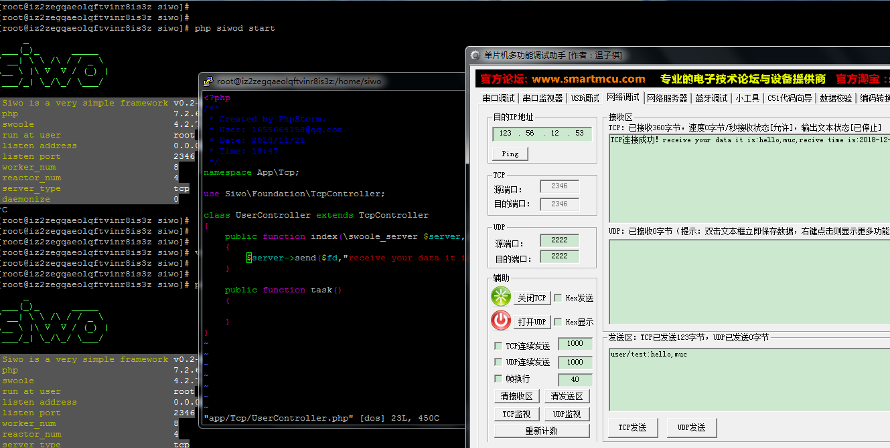

# MarkDown
my msg
- name:tom
- age:100
- address:shanghai china
## 标题
# 标题1
## 标题2
### 标题3
#### 标题4
##### 标题5
###### 标题6
标题1：with=
===
标题2：with-
---

I am a boss,we will create a best company in this world.  
so please pay for money.

## 段落
## 强调

我是粗体**文字**哦  
我是*斜体*文字样式哦
我是***粗体加斜体***文字样式哦
我是~~删除~~线

我是_你_，你是__我__，我是___他___
## 列表
* name:jack
* age:100

- name:tom
  - name:huhu
  - age:900
    - name:lucy
    - age:90000
- age:300

1. name:jack
2. age:200

## 链接demo
### 内嵌式连接
- 外部链接：[百度](http://www.baidu.com)
- 内部链接1：连接仓库的其它文件:[doc](doc/doc.md)
- 内部链接2：连接本文档的其它部分:[引用 demo](README.md#引用-demo)

### 引用式连接
- 外部链接：[百度][baidu]
- 内部链接1：连接仓库的其它文件:[doc]
- 内部链接2：连接本文档的其它部分:[引用 demo]
## 图片demo



- 引用式图片
![baidu][baidu-logo]

![][mcu]

## 引用 demo
> 这是一个引用  

                        --出自<<引用>>
                        
>>> 这是多重引用了                        
## 代码块demo
- 行内代码
下面定义了`int a = 10,int *p,p=&a;`的语句，然后打印它
- 块式代码
```c
    int a = 10;
    int *p;
    p = &a;
    printf("p=%p,p=%d\n",&*p,*&*p);
```

<!-- 下面是连接 -->
[百度]:http://www.baidu.com
[baidu]:http://www.baidu.com
[doc]:doc/doc.md
[引用 demo]:README.md#引用-demo

[baidu-logo]:https://www.baidu.com/img/bd_logo1.png 'baidu'
[mcu]:images/mcu.png

## 水平分割线
<hr>dd
---
<br>
***
<br>
___

## HTML
<h5 style="color:red;font-size:30px;" align="center">hello,world</h5>
<p align="center">hello,world</p>

<video src="https://jsmov2.a.yximgs.com/bs2/newWatermark/MTA2NjcyMzg4NzY_zh_4.mp4" autoplay></video>

## 表格
| 姓名 | 年龄 | 身高 |
|-----|:------:|------|
|  张三| 30   | 200  |
| **李四** | 90055325325235235235235235 |190 |
| 张飞 | ![][baidu-table-logo][baidu-link] | 900 |

## GFM
menus
-  [x] open
-  [ ] close
-  [x] create
-  [ ] new

## emoji
:factory: 
<!-- auot -->
[baidu-table-logo]:https://www.baidu.com/img/bd_logo1.png
[baidu-link]:https://www.baidu.com

## 综合场景

[](http://www.baidu.com)

[![bd][baidu-i-logo]][baidu-i]

[百度][baidu-i]
[百度搜索][baidu-i]
<!-- link -->
[baidu-i]:http://www.baidu.com
[baidu-i-logo]:http://www.baidu.com/img/bd_logo1.png
